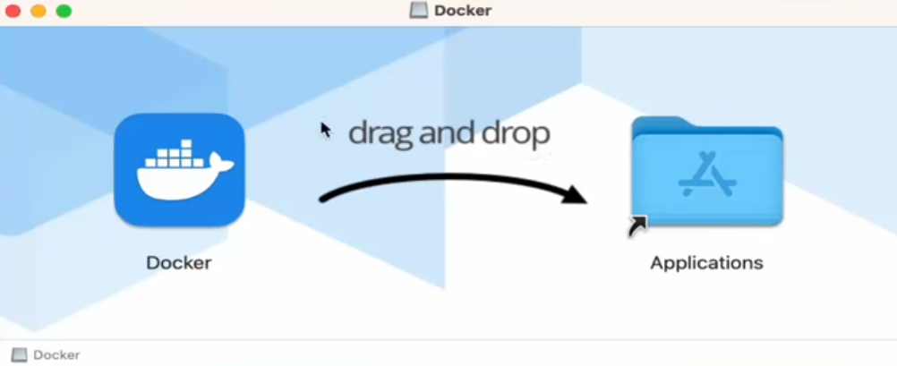
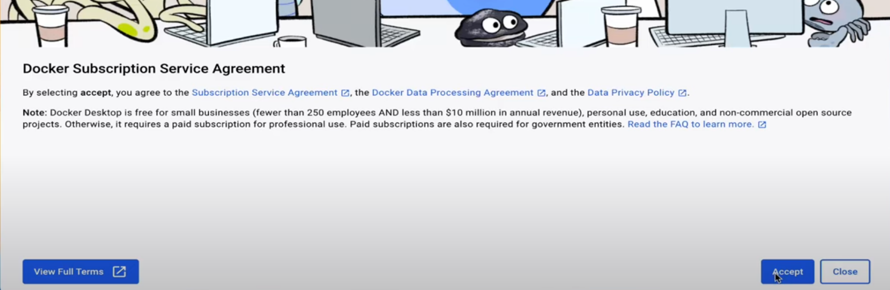
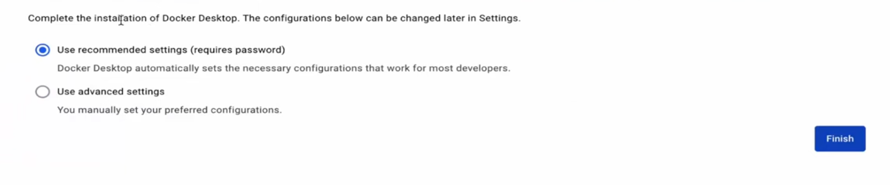

## Quick Start
Docker is an open-source project developed in Go language, which could package software and its dependencies into images for a quick deployment environment.

For users, please visit Docker's official website to download the Docker Desktop application: https://docs.docker.com/get-docker/

Notes:
  - For Windows users, WSL2, the dependency of Docker, will be automatically installed during Docker Desktop install. If an error occurs, users need to refer to Microsoft's documentation to download and set up the [WSL2 subsystem](https://docs.microsoft.com/en-us/windows/wsl/install) manually, and check the [install steps of docker desktop](https://docs.docker.com/desktop/setup/install/windows-install/).
  - For Mac users, the macOS operating system is suitable for docker desktop installation, and theoretically that will not fail. If an error occurs, users need to refer to the [install steps of docker desktop](https://docs.docker.com/desktop/setup/install/mac-install/).
  - If your network can not access the Docker Desktop website, please contact us, and we will provide a download link of Netdisk.

## Docker Desktop Installation Steps

### For MacOS users

- > Requirements
  - At least 8 GB of RAM.
  - Due to the MacOS system is unix-based and only developed by Apple, the only requirement is the Latest versions of macOS.

- Installation Steps
  - Download the Docker Desktop for Mac from the official website: https://docs.docker.com/get-docker/
  - Double-click Docker.dmg to open the installer.
  - Drag the Docker icon to the Applications folder. By default, Docker Desktop is installed at /Applications/Docker.app.
    

  - Double-click Docker.app in the Applications folder to start Docker.
  - Select Accept in the "Docker Subscription Service Agreement" to continue.
    

  - Finish set up Docker Desktop (Recommend to use the default settings).
    

### For Windows users

- Requirements
  - 64 bit processor.
  - 8GB system RAM.
  - Docker Desktop's functionality remains consistent on both WSL and Hyper-V (without a preference for either architecture).
  - For WSL 2 backend, x86_64
    - WSL version 1.1.3.0 or later.
    - Windows 11 64-bit: Home or Pro version 22H2 or higher, or Enterprise or Education version 22H2 or higher.
    - Windows 10 64-bit: Minimum required is Home or Pro 22H2 (build 19045) or higher, or Enterprise or Education 22H2 (build 19045) or higher.
    - Turn on the WSL 2 feature on Windows. For detailed instructions, refer to the [WSL documentation](https://learn.microsoft.com/en-us/windows/wsl/install) or [Chinese blog for tutorial](https://www.cnblogs.com/taylorshi/p/13586922.html).
  - Hyper-V backend, x86_64
    - Windows 11 64-bit: Home or Pro version 22H2 or higher, or Enterprise or Education version 22H2 or higher.
    - Windows 10 64-bit: Minimum required is Home or Pro 22H2 (build 19045) or higher, or Enterprise or Education 22H2 (build 19045) or higher.
    - Turn on Hyper-V and Containers Windows features. For detailed instructions, refer to the [Hyper-V documentation](https://learn.microsoft.com/en-us/virtualization/hyper-v-on-windows/quick-start/enable-hyper-v) or [Chinese blog for tutorial](https://www.sysgeek.cn/install-hyper-v-windows/)

## The possible errors and solutions

- MacOS system version is too low
  - Solution 1: Update the MacOS system to the latest version.
  - Solution 2: Select the eligible version of Docker Desktop for Mac.
    - View the release notes of Docker Desktop:https://docs.docker.com/desktop/release-notes/
    - Download the version that matches the MacOS system version according to the release notes.
    - If the download link of some earlier version is not available, please see: [List of Direct Download links for Docker Desktop from version 4.0.0 released 2021-08-31 thru 4.22.1 released 2023-08-24](https://gist.github.com/hydra1983/5010eb5b16f4faf4dd39ddb6660cac80)