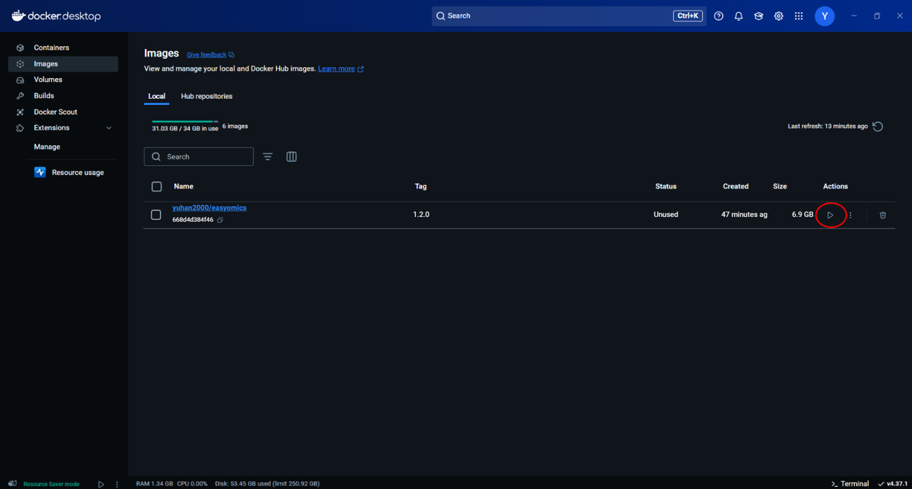

- Click the **run button** to create a container of downloaded image.

- Set the container parameters. 
  - Container name could be any character (eg.gwas_test).
  - Host port could be 0 or any other four digits (eg. 3838).
  - Directory :
    - <b>Host path is the local empty directory path to save analysis results (eg. C:/Desktop/new_dir/). </b>
    - <b>Container path must be "/srv/shiny-server/Analysis_Result/" to mount the result of the container.</b>
  - Environment variables don't need setting.

- Click to run button to finish the container creation process.
- **Go to "Containers" page** of Docker Desktop and run the created container.
- Enter "localhost:Host port of container" (eg. localhost:3838) in the **web browser's** (eg.Chrome, Firefox, Edge......) address bar to enter the software interactive interface. If "Host port" of container was set to 0, please check the port of the container in the "Container" panel.
- When performing analysis, result will be automatically output into Host path.
- The feedback and error of EasyOmics and the invoked software are displayed in the "Logs" bar of the "Container" and software panel during the analysis.

- Click the stop button on the "Container" page to exit the software.
