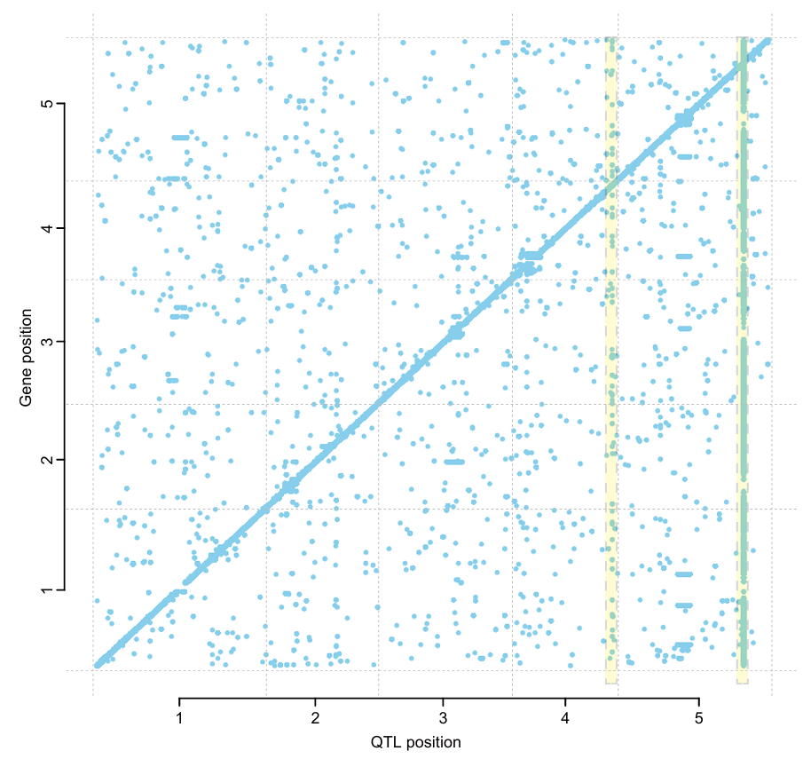
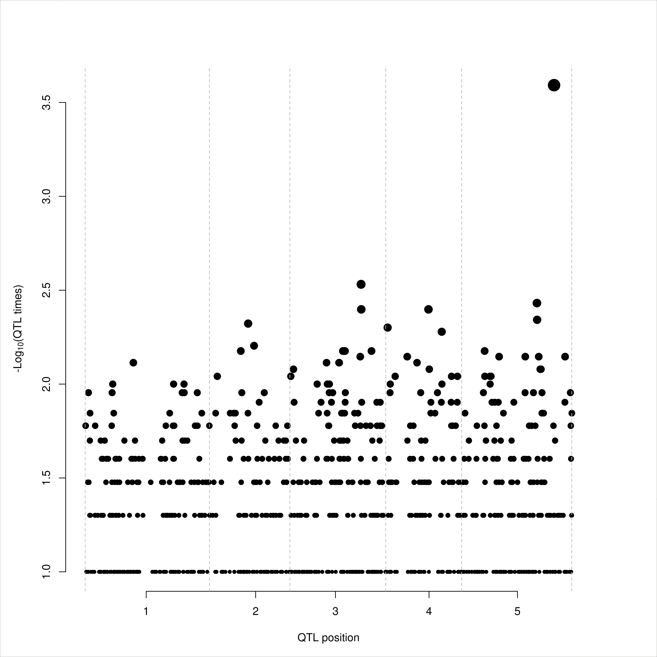
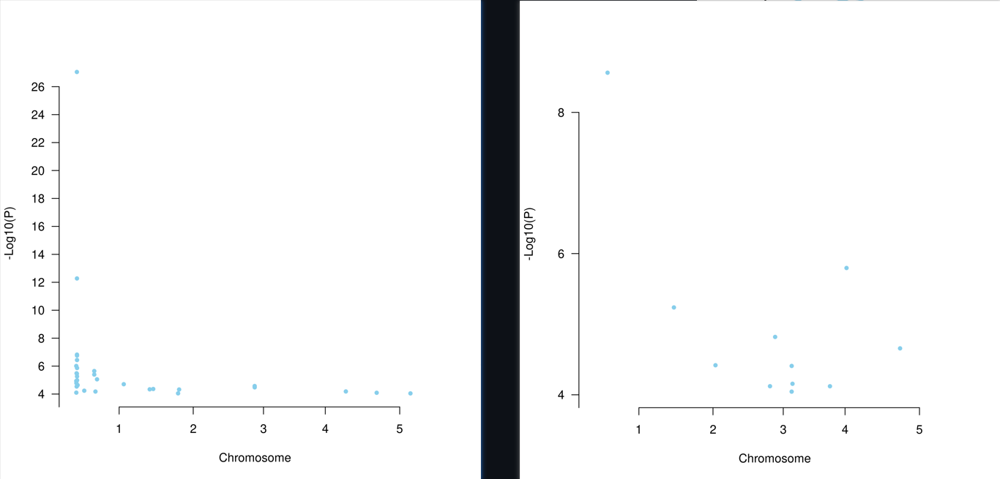

### Analysis Process

- Converts the input data to the format required by the software MatrixQTL.
- EasyOmics uses Plink for principal component analysis of population structure
- Uses the top 20 principal components as covariates for parallel linear model-based association analysis of each omics data and genotype data. 
- Calculates the chromosomal positions of SNPs and molecular traits based on the user's input in file and displays them. 
- Visualizes the results of the analysis.

### Input and Output

> Input Parameters

|Parameter|Description|
|--|--|
|Upload Omic Phenotype Data File|The omic phenotype data, format is shown in "Data Preparation".|
|Upload GFF Data File|The GFF data, format is shown in "Data Preparation".|
|Upload VCF Data File|The VCF data, format is shown in "Data Preparation".|
|Select GFF Type|The type of GFF file. If the probe of omic data is located in the genome and (1) is gene, upload the genome annotation GFF file. (2) is not gene, upload the probe position GFF like file. If the probe of omic data is not located in the genome, select "Not gene", and users can skip the GFF file upload.|
|Normalization Data|Wether to normalize the omic data using zscore method.|
|Threshold|A value setting the significance threshold (P-value) for Omic QTL analysis. SNPs with P-values below this threshold are retained. Supports numeric input, defaulting to 5e-8. For users unsure of the significance threshold, entering "Bonferroni" sets it to 0.05 divided by the number of SNPs.|
|Other Parameters|Other parameters of the main invoked software for this analysis.|

> Output Results

|Filename|Description|
|--|--|
|Time_qtls.txt|The output of the invoked software for the Omic QTL analysis, including the significant associated snps.|
|Time_qtl_1e-4.txt|The output of the invoked software for the Omic QTL analysis, including the associated snps with p-value less than 1e-4.|
|Time_cis-trans_plot.pdf&png|The visualized results of the Omic QTL analysis. If genomic position of the omic data is provided, this plot will show the significant associated snps's position and the omic data's position. If not, it will not be shown.|
|Time_QTL_times.pdf&png|The visualized results of the Omic QTL significant association frequency.|
|Time_Omic_manhattan_plot|A directory containing the Manhattan plot of the association results for each omic data (with significant association result).|

### Main Results Interpretation

- Scatter plot of genes or probes and their QTL positions on chromosomes.The x-axis represents the genomic positions of the detected eQTL, while the y-axis represents the genomic positions of the associated genes.

<div align=center></div>

- Text file containing association results of all SNPs.
  
```txt
SNP gene beta t-stat p-value FDR
1:19461508 AT1G52270 0.674590385651332 28.123511975575 4.14591267172224e-112 2.02150807617404e-102
1:19462038 AT1G52270 0.674590385651332 28.123511975575 4.14591267172224e-112 2.02150807617404e-102
1:19462623 AT1G52270 0.673281447249011 27.9516480473353 3.39978031137861e-111 8.28850472845873e-102
1:19462886 AT1G52270 0.673281447249011 27.9516480473353 3.39978031137861e-111 8.28850472845873e-102
1:19463170 AT1G52270 0.671582251314867 27.9031631086884 6.15721634281558e-111 1.20088034160951e-101
```
- The p-value: Similar to GWAS, the p-value of SNPs means the significance of the association with some molecular phenotype. Only the association with p-value passed the threshold could be saved. 
- The cis-trans QTLs: A cis-QTL represents a quantitative trait locus that is located near the genomic position of the omic trait it influences. This proximity often suggests a direct regulatory relationship. Conversely, a trans-QTL is identified as a QTL that is distal to the position of the omic trait, indicating an influence that is mediated through more complex genetic and molecular interactions. 

- Scatter plot of the QTL significant association frequency. The x-axis represents the genome position, which was seperated by 50,000bp. The y-axis represents the number of significant associations. For example, the top-right corner of the point represents qtls located in this region are significantly associated with ~10^3.6 omics data, which also means the potential trans-QTLs.
<div align=center></div>

- The figures at folder "Time_Omic_manhattan_plot": This is a filtered Manhattan plot of the association results for each omic data. Only snps with association p-value less than 1e-4 are shown in the plot. As same as manhattan plot in GWAS, the x-axis represents the genomic position of the snps, and the y-axis represents the -log10(p-value) of the association. These figures were used to identify the stochastic association and highly potential association. If a visible peak is shown in the plot, it means the significant association between this omic probe and the qtl around the peak is highly potential.
  - The left figure shows a peak located in the top region of chromosome 1, which means the omic probe located in this region is highly associated with the qtl around this region.
  - The right figure don't show any peak, which means the omic probe located in this region perhaps is not a true association.

<div align=center></div>


### Citation

Shabalin, A.A., 2012. Matrix eQTL: Ultra fast eQTL analysis via large matrix operations. Bioinformatics 28, 1353–1358. https://doi.org/10.1093/bioinformatics/bts163
