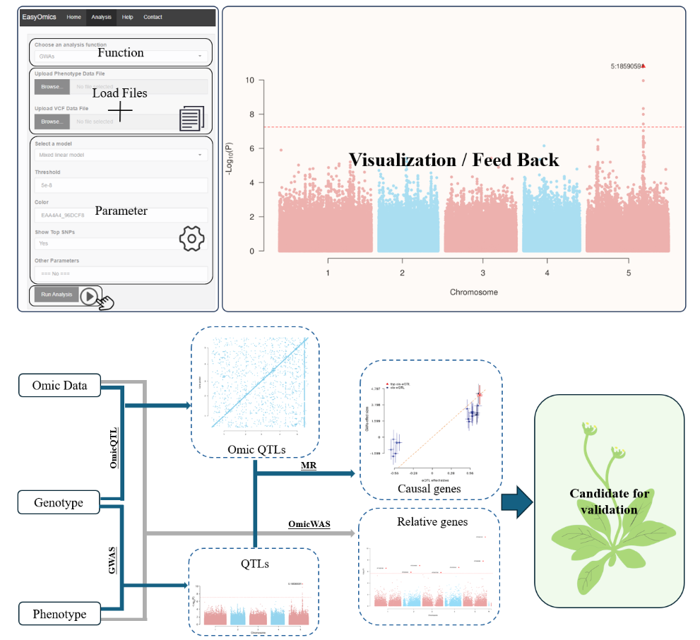

Each function in EasyOmics is independent, allowing users to input data, adjust parameters, run analyses, and visualize results with simple point-and-click actions.

The sidebar contains a selection list for analysis functions, a file upload panel, a parameter control panel, and an action button. The main panel visualizes the analysis output and displays feedback.

This significantly simplifies population-scale omics data analysis, making it more convenient for biologists to perform a series of omics analyses.

In EasyOmics workflow, GWAs function can perform association analysis between genotype and phenotype and find QTLs with significant association. Omics QTL function treats omic data as molecular phenotype and tests the association with genotypic data. MR function integrates the QTLs and OmicQTLs to perform causal inference. OmicsWAS tests the association between phenotypic and omics data.

--- 

## Introduction
A graphical interface for population-scale omics data association, integration and visualization

EasyOmics is an R Shiny application with a graphic user interface (GUI) application that integrates the Omic data for GWAS analysis. It is a user-friendly application that allows users to perform association analysis locally without any coding.

Moreover, it simplifies data compatibility issues across various analysis tools, requiring only VCF, GFF, and phenotype TXT files.

The analysis parameters of invoked tools are automatically set to default values, which reduces the complexity of parameter setting for users.

Parameters also could be adjusted by users in the "Other Parameters" input text box of every analysis function.
The setted parameters are the main invoked softwares' parameters. Please see "Citation" for the main invoked softwares' references.

|Function|Description|
| ----------- | ----------- |
|**Data Matching**|Preparing input files for subsequent analysis. |
|**Phenotype Analysis**|Providing critical insights into the input data characteristics and facilitates the detection of outlier values.|
|**GWAS**|Testing the significance of associations between each SNP and the phenotype using a linear mixed model.|
|**COJO**|Fine mapping of GWAS result and identify secondary association signals.|
|**Locus Zoom**|Displaying the significance, linkage, and nearby genes of SNPs in specific chromosome regions.|
|**Omic QTL**|Employing linear models for association analysis of omics data and genotype data.|
|**Two Traits MR**|Exploring causal relationships between two traits.|
|**SMR**|Exploring causal relationships between trait and omic molecular trait.|
|**OmicWAS**|Testing the associations between omic data and complex traits.|

---
## Citation
If you use EasyOmics, please cite the appropriate article:

EasyOmics:

Han, Y., Du, Q., Dai, Y., Gu, S., Liu, W., et al., 2024. EasyOmics-A graphical interface for population-scale omics data association , integration and visualization. bioRxiv. https://doi.org/10.1101/2024.02.20.581292 

Data Matching:

Chen, Z.L., Meng, J.M., Cao, Y., Yin, J.L., Fang, R.Q., et al., 2019. A high-speed search engine pLink 2 with systematic evaluation for proteome-scale identification of cross-linked peptides. Nat. Commun. 10. https://doi.org/10.1038/s41467-019-11337-z

Phenotype Analysis:

Yang, J., Lee, S.H., Goddard, M.E., Visscher, P.M., 2011. GCTA: A tool for genome-wide complex trait analysis. Am. J. Hum. Genet. 88, 76–82. https://doi.org/10.1016/j.ajhg.2010.11.011

GWAS:

Yang, J., Lee, S.H., Goddard, M.E., Visscher, P.M., 2011. GCTA: A tool for genome-wide complex trait analysis. Am. J. Hum. Genet. 88, 76–82. https://doi.org/10.1016/j.ajhg.2010.11.011

COJO:

Yang, J., Ferreira, T., Morris, A.P., Medland, S.E., Madden, P.A.F., et al., 2012. Conditional and joint multiple-SNP analysis of GWAS summary statistics identifies additional variants influencing complex traits. Nat. Genet. 44, 369–375. https://doi.org/10.1038/ng.2213

Locus Zoom:

Dong, S.-S., He, W.-M., Ji, J.-J., Zhang, C., Guo, Y., et al., 2021. LDBlockShow: a fast and convenient tool for visualizing linkage disequilibrium and haplotype blocks based on variant call format files. Brief. Bioinform. 22, bbaa227. https://doi.org/10.1093/bib/bbaa227

Omic QTL:

Shabalin, A.A., 2012. Matrix eQTL: Ultra fast eQTL analysis via large matrix operations. Bioinformatics 28, 1353–1358. https://doi.org/10.1093/bioinformatics/bts163

Two Traits MR:

Zhu, Z., Zheng, Z., Zhang, F., Wu, Y., Trzaskowski, M., et al., 2018. Causal associations between risk factors and common diseases inferred from GWAS summary data. Nat. Commun. 9. https://doi.org/10.1038/s41467-017-02317-2

SMR:

Zhu, Z., Zhang, F., Hu, H., Bakshi, A., Robinson, M.R., et al., 2016. Integration of summary data from GWAS and eQTL studies predicts complex trait gene targets. Nat. Genet. 48, 481–487. https://doi.org/10.1038/ng.3538

OmicWAS:

Zhang, F., Chen, W., Zhu, Z., Zhang, Q., Nabais, M.F., et al., 2019. OSCA: A tool for omic-data-based complex trait analysis. Genome Biol. 20, 1–13. https://doi.org/10.1186/s13059-019-1718-z
